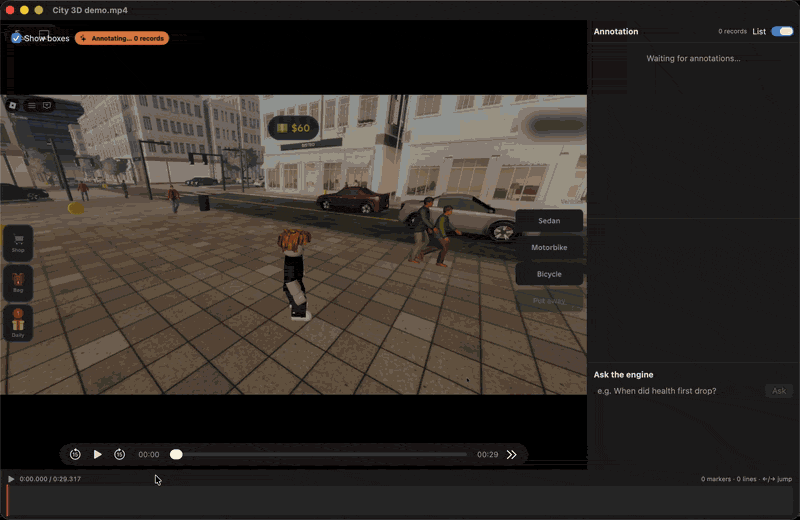
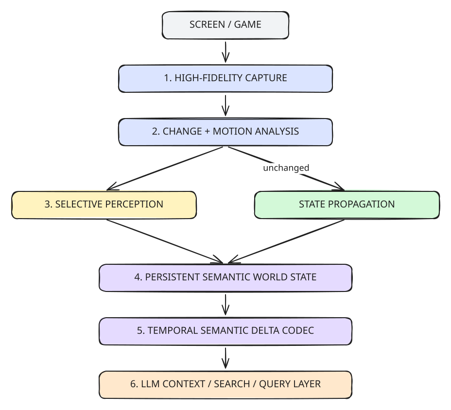
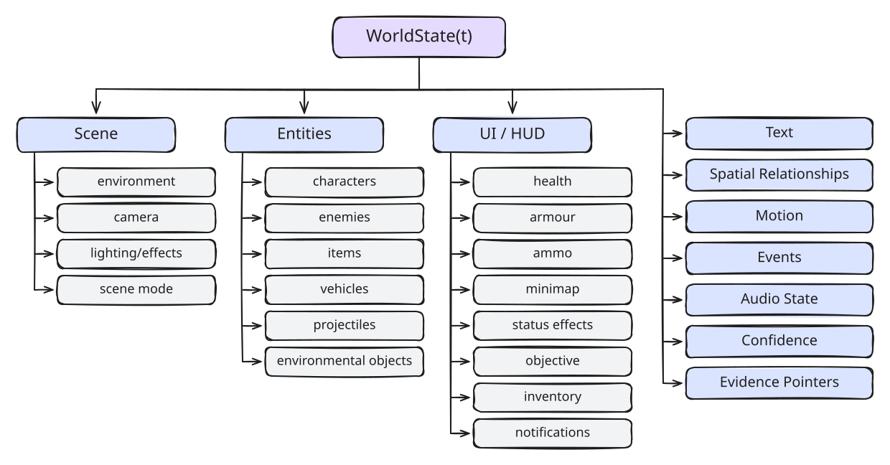
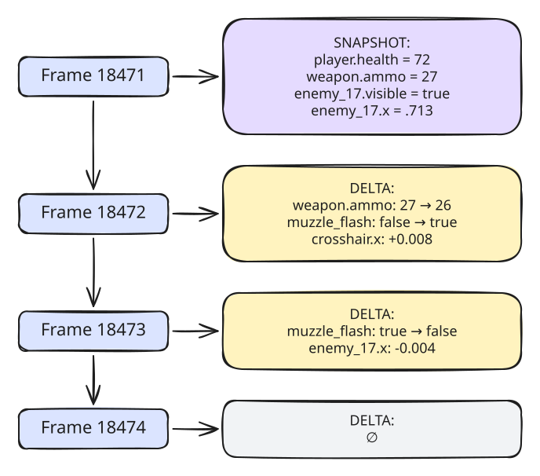
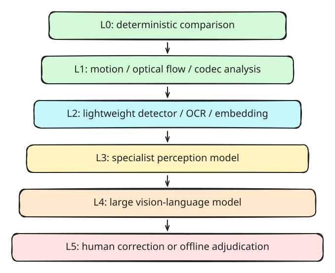
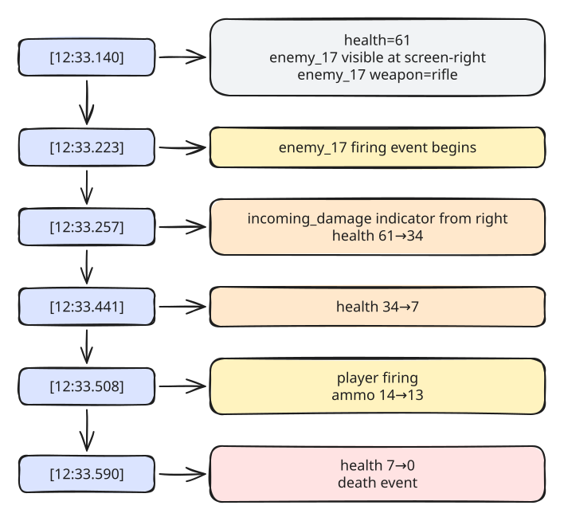
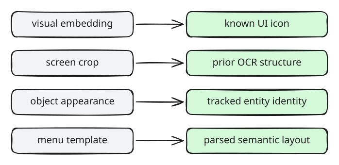
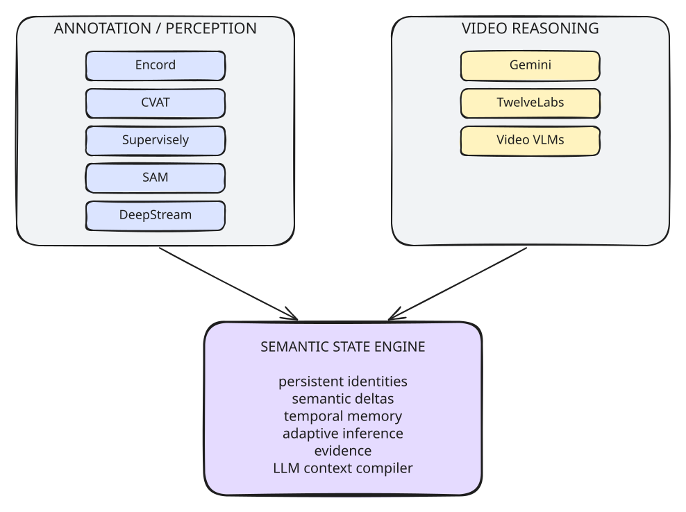
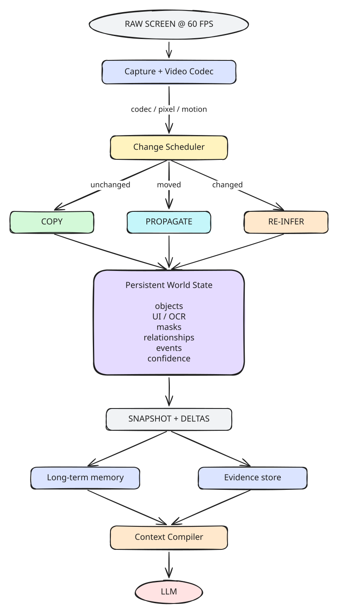

# Gameplay Recorder Annotator

**The Semantic Video State Engine turns every moment of high-frame-rate video into a persistent, evidence-grounded machine world state while spending expensive vision compute primarily on what actually changed.**

A macOS screen recorder with the same toolbar as the built-in one (⇧⌘5), plus an engine that converts each 60 fps recording into a queryable semantic state stream. You can then ask Claude questions about the recording and get answers that cite exact frames.



<sub>Demo: a 3D city game (Roblox) recorded with the app at 60 fps. The review window annotates it (8×6 region-mode grid, entity boxes, 1 fps Claude annotations, events lane) and answers a question with the exact frame, then plays the annotated recording at 1.5× as the cash goes $60 → $85 → $95. Parts are sped up.</sub>

## Quick start

Requirements: macOS 15+ with Xcode, [Homebrew](https://brew.sh), Python 3.11+ and an Anthropic API key. The key is read from `ANTHROPIC_API_KEY` or `.secrets/anthropic.env`, and is needed only for Claude annotation and answers.

```sh
git clone https://github.com/esxr/gameplay-recorder-annotator.git && cd gameplay-recorder-annotator
brew install xcodegen ffmpeg tesseract && python3 -m venv .venv && .venv/bin/pip install -r engine/requirements.txt
app/build.sh && open build/GameplayRecorder.app
.venv/bin/python engine/run.py samples/city-3d.mp4
.venv/bin/python engine/api.py samples/city-3d.mp4.session ask "When did the cash first increase, and by how much?"
```

1. Clone the repo.
2. Install the tools and the engine's Python packages.
3. Build and open the app. It lives in the menu bar. Press **⌥⌘5** to show the capture toolbar, choose a mode, then press **Record**. Stop from the menu-bar item. The first recording asks for the Screen Recording permission. On stop, the app annotates the recording, runs the engine and opens the review window.
4. Run the engine on the bundled 10 s clip of 3D gameplay. This writes `samples/city-3d.mp4.session/` (`stream.jsonl`, `events.jsonl`, `summary.json`, `evidence/`, `meta.json`).
5. Ask a question. The engine compiles at most 4,000 tokens of state for Claude, sends no raw frames, and prints the answer with its evidence frames.

To query over HTTP, run `.venv/bin/python engine/server.py`. It serves port 8765 with `GET /get_state`, `/get_changes`, `/get_entity_history`, `/get_events`, `/search_semantics`, `/get_evidence`, `/compile_context` and `/reanalyze`, plus `POST /ask`. See [`engine/CONTRACT.md`](engine/CONTRACT.md).

## Results

The engine was measured on a 76 s, 60 fps app recording of the [test game](testgame/). It was scored against the game's own per-frame ground truth, which only the evaluator reads (`engine/report.py`).

| Check | Result | Proof |
|---|---|---|
| Frames on the timeline | 4580 / 4580 (= ffprobe `nb_frames`) | [pipeline-G1-report.txt](proofs/pipeline-G1-report.txt) |
| Region-frames that skip the vision model (COPY + PROPAGATE + REVALIDATE) | 99.58% | [pipeline-G1-report.txt](proofs/pipeline-G1-report.txt) |
| Frames that call the vision model | 20 / 4580 = 0.44% | [pipeline-G1-report.txt](proofs/pipeline-G1-report.txt) |
| State rebuilt from snapshot + deltas = direct replay | 20 / 20 | [pipeline-G2-report.txt](proofs/pipeline-G2-report.txt) |
| Storage vs dense per-frame JSON | 14.3× smaller | [pipeline-G2-report.txt](proofs/pipeline-G2-report.txt) |
| Identity switches | 0.37% | [pipeline-G2-report.txt](proofs/pipeline-G2-report.txt) |
| 1- and 2-frame flashes found at the exact frame | 10 / 10 (1 fps sampling: 0 / 10) | [pipeline-G3-report.txt](proofs/pipeline-G3-report.txt) |
| HUD changes at the exact frame with the correct value | health 10 / 10, ammo 31 / 31 | [pipeline-G3-report.txt](proofs/pipeline-G3-report.txt) |
| State fields missing provenance | 0 of 89920 | [pipeline-G4-report.txt](proofs/pipeline-G4-report.txt) |
| Query ops over HTTP returning 200 | 8 / 8 | [pipeline-G5-api.txt](proofs/pipeline-G5-api.txt) |
| Questions answered correctly (claude-sonnet-5-5, questions frozen before answering) | 9 / 10 | [pipeline-G5-report.txt](proofs/pipeline-G5-report.txt) |
| Largest compiled context | 3849 tokens (0.084% of all-frame image input) | [pipeline-G5-report.txt](proofs/pipeline-G5-report.txt) |
| In-app run: all 7 stages, then an answered question | capture → change → schedule → state → store → compile → answer | [pipeline-G6-applog.txt](proofs/pipeline-G6-applog.txt), [pipeline-G6-ask.png](proofs/pipeline-G6-ask.png) |

## Repository layout

| Path | What it is |
|---|---|
| [`app/`](app/) | SwiftUI/AppKit recorder: toolbar clone, ScreenCaptureKit → H.264 60 fps writer, Claude annotation, review window |
| [`engine/`](engine/) | Semantic Video State Engine (Python): region scheduler, tracker, HUD OCR, events, snapshot + delta store, query API, context compiler |
| [`testgame/`](testgame/) | 60 Hz test game that writes per-frame ground truth (used for the results below) |
| [`samples/`](samples/) | `city-3d.mp4`: first 10 s of the demo recording, for the Quick start |
| [`proofs/`](proofs/) | Evidence for every result above |
| [`docs/`](docs/) | Demo GIF and Excalidraw diagrams (`docs/diagrams/*.excalidraw`) |
| [`knowledge/`](knowledge/) | Project wiki, including the source PRD ([`knowledge/raw/semantic-video-state-engine-prd.md`](knowledge/raw/semantic-video-state-engine-prd.md)) |

---

The rest of this README is the product requirements document it was built from.


## Product Requirements Document  
### Semantic Video State Engine

**Document status:** Product definition  
**Research cutoff:** 30 September 2026  
**Working product name:** Semantic Video State Engine  
**Core output:** Temporal Semantic State Stream  
**Primary domain:** High-frame-rate gameplay and screen recordings  
**Secondary domains:** Computer-use agents, robotics video, simulation, sports, surveillance, UI testing, multimodal model training

---

### PRD table of contents

- [1. Executive Summary](#1-executive-summary)
- [2. Problem Statement](#2-problem-statement)
- [3. Product Vision](#3-product-vision)
- [4. Product Thesis](#4-product-thesis)
- [5. Target Users](#5-target-users)
- [6. Core User Job](#6-core-user-job)
- [7. Goals](#7-goals)
- [8. Non-Goals](#8-non-goals)
- [9. Research Foundation](#9-research-foundation)
- [10. Existing Commercial Landscape](#10-existing-commercial-landscape)
- [11. Product Definition](#11-product-definition)
- [12. The 60 FPS Contract](#12-the-60-fps-contract)
- [13. Persistent Semantic World State](#13-persistent-semantic-world-state)
- [14. Semantic Annotation Taxonomy](#14-semantic-annotation-taxonomy)
- [15. UI and HUD State](#15-ui-and-hud-state)
- [16. OCR and Text](#16-ocr-and-text)
- [17. Relationships](#17-relationships)
- [18. Event Layer](#18-event-layer)
- [19. Semantic Delta Representation](#19-semantic-delta-representation)
- [20. Snapshot + Delta Storage Model](#20-snapshot--delta-storage-model)
- [21. Spatial Representation](#21-spatial-representation)
- [22. Change Detection Engine](#22-change-detection-engine)
- [23. Selective Inference Scheduler](#23-selective-inference-scheduler)
- [24. Drift Prevention](#24-drift-prevention)
- [25. Three Semantic Memory Levels](#25-three-semantic-memory-levels)
- [26. Perception Model Architecture](#26-perception-model-architecture)
- [27. Model Hierarchy](#27-model-hierarchy)
- [28. LLM Context Compiler](#28-llm-context-compiler)
- [29. Query-Adaptive Fidelity](#29-query-adaptive-fidelity)
- [30. Evidence and Provenance](#30-evidence-and-provenance)
- [31. Capture Requirements](#31-capture-requirements)
- [32. Frame Identity](#32-frame-identity)
- [33. Very Short Event Preservation](#33-very-short-event-preservation)
- [34. Functional Requirements](#34-functional-requirements)
- [35. Non-Functional Requirements](#35-non-functional-requirements)
- [36. Annotation Density](#36-annotation-density)
- [37. Output Formats](#37-output-formats)
- [38. Example Semantic Stream](#38-example-semantic-stream)
- [39. Session Query API](#39-session-query-api)
- [40. Streaming API](#40-streaming-api)
- [41. Live Inspection Interface](#41-live-inspection-interface)
- [42. Session Explorer](#42-session-explorer)
- [43. LLM Integration Modes](#43-llm-integration-modes)
- [44. Game-Specific Adaptation](#44-game-specific-adaptation)
- [45. Learning From Repetition](#45-learning-from-repetition)
- [46. Semantic Cache](#46-semantic-cache)
- [47. Audio](#47-audio)
- [48. Input Actions](#48-input-actions)
- [49. Quality Strategy](#49-quality-strategy)
- [50. Human Verification](#50-human-verification)
- [51. Success Metrics](#51-success-metrics)
- [52. Evaluation Dataset](#52-evaluation-dataset)
- [53. Critical Benchmark Questions](#53-critical-benchmark-questions)
- [54. Compute Efficiency Requirements](#54-compute-efficiency-requirements)
- [55. Change Versus Meaning](#55-change-versus-meaning)
- [56. Scene Resets](#56-scene-resets)
- [57. Failure Modes](#57-failure-modes)
- [58. Privacy and Security](#58-privacy-and-security)
- [59. Anti-Cheat and Game Integrity Boundary](#59-anti-cheat-and-game-integrity-boundary)
- [60. Model-Agnostic Architecture](#60-model-agnostic-architecture)
- [61. Recommended Current Component Strategy](#61-recommended-current-component-strategy)
- [62. Build Versus Buy](#62-build-versus-buy)
- [63. Core Product Scope](#63-core-product-scope)
- [64. Extended Capabilities](#64-extended-capabilities)
- [65. Acceptance Criteria](#65-acceptance-criteria)
- [66. Key Research Questions](#66-key-research-questions)
- [67. Strategic Differentiation](#67-strategic-differentiation)
- [68. Long-Term Technical Thesis](#68-long-term-technical-thesis)
- [69. Reference Research](#69-reference-research)
- [70. Reference Products and Platforms](#70-reference-products-and-platforms)
- [71. Product in One Sentence](#71-product-in-one-sentence)
- [72. Product in One Diagram](#72-product-in-one-diagram)

---

## 1. Executive Summary

The Semantic Video State Engine converts high-frame-rate screen video into a dense, temporally continuous, machine-readable representation suitable for large language models and other reasoning systems.

The key insight is that an LLM should not have to repeatedly reinterpret every pixel of every video frame.

Instead, the system maintains a persistent semantic representation of the screen:

- objects,
- text,
- UI elements,
- masks,
- positions,
- attributes,
- relationships,
- motion,
- events,
- game-state variables,
- confidence,
- and source evidence.

The system captures every video frame at the source frame rate, with **60 fps as the baseline target**, while avoiding expensive neural inference across the entire screen on every frame.

Each incoming frame advances the semantic state. Depending on what has changed, a region may be:

1. copied from the previous semantic state,
2. geometrically propagated,
3. cheaply revalidated,
4. partially re-inferred,
5. or fully re-annotated.

The resulting representation is therefore more analogous to a **semantic video codec** than ordinary video captioning.

Traditional video compression approximately answers:

> Which pixels changed?

This product answers:

> Which meaningful entities, properties, relationships, and events changed?

The result is a high-bandwidth representation that preserves fast game events while being far more efficient for an LLM than independent natural-language descriptions of every frame.

The product is not primarily a video captioner and not primarily a labeling UI. It is a **continuous perception and semantic-state infrastructure layer** between pixels and reasoning models.

---

## 2. Problem Statement

Modern multimodal models can consume video, but raw video is an extremely inefficient representation for precise temporal reasoning.

A single second of 60 fps gameplay contains 60 separate visual states. Important events may last only a handful of frames:

- muzzle flashes,
- damage indicators,
- enemy appearances,
- parries,
- animation transitions,
- button prompts,
- inventory changes,
- crosshair movements,
- hit markers,
- kill-feed changes,
- minimap events,
- resource changes,
- status effects,
- or brief text.

Current general-purpose video models often dramatically reduce this information before reasoning over it. For example, Gemini's documented default static video processing samples visual frames at 1 fps, and Google warns that fast motion or rapid scene changes can therefore be missed. Its newer agentic video mode selectively explores relevant parts of a video rather than exhaustively representing every source frame.

At the opposite extreme, independently applying large vision models to every region of every 60 fps frame is computationally wasteful because adjacent frames usually contain very large amounts of redundant information.

Research has repeatedly demonstrated that video computation can exploit this temporal redundancy. Deep Feature Flow performs expensive recognition on sparse keyframes and propagates features between them; Video Propagation Networks propagate structured semantic information forward through video; modern video-LLM approaches similarly reduce computation by merging or pruning redundant visual tokens.

The product opportunity is therefore to build a persistent semantic representation in between these two extremes.

---

## 3. Product Vision

Create the highest-fidelity practical representation of screen video for machine reasoning by converting:

**pixels over time**

into:

**persistent entities + state changes + events + evidence over time.**

The system should allow an LLM to reason about a game session as if it had access to a structured observer continuously watching the screen.

A reasoning model should be able to ask questions such as:

- What was visible when the player started taking damage?
- Which enemy first entered the player's field of view?
- What changed in the HUD immediately before death?
- How many rounds were fired during this encounter?
- Was the object visible before the player reacted?
- What was the player's health, ammo, position on the minimap, and current weapon at a specific instant?
- Which UI element changed after the player pressed a button?
- Show the exact visual evidence supporting this conclusion.
- Reconstruct the semantic state at frame 18,472.
- Summarize only the important deltas during this fight.
- Retrieve every moment where a particular object, UI condition, or interaction occurred.

---

## 4. Product Thesis

The optimal representation for high-frame-rate video reasoning is neither:

**raw frames**

nor:

**independent captions for every frame.**

It is:

**persistent semantic state + temporally encoded deltas + selectively retained visual evidence.**

This leads to five fundamental design decisions.

#### 4.1 Capture densely

Every source frame should remain temporally addressable.

#### 4.2 Infer sparsely where possible

Full expensive inference should not be required for every unchanged region.

#### 4.3 Preserve identity through time

The representation must understand that an enemy in frame 1,000 and the same enemy in frame 1,001 are the same entity rather than two unrelated detections.

#### 4.4 Encode change rather than repetition

If `player.health = 73` has not changed for 180 frames, the value should not have to be semantically generated 180 additional times.

#### 4.5 Preserve evidence

Semantic compression must not eliminate the ability to inspect the original pixels that led to an annotation.

---

## 5. Target Users

### 5.1 AI/gameplay researchers

Need extremely detailed game-video datasets without manually annotating every frame.

### 5.2 Agent developers

Need machine-readable screen state for agents that reason about visual environments.

### 5.3 Multimodal foundation-model teams

Need dense, structured video supervision and high-quality temporal training data.

### 5.4 Game analytics teams

Need automatic extraction of gameplay state, events, and interactions from video when internal game telemetry is unavailable.

### 5.5 Dataset and evaluation teams

Need temporally consistent ground truth for evaluating video-language and embodied-agent models.

### 5.6 Advanced users

Want to turn their own gameplay or computer sessions into searchable semantic histories.

---

## 6. Core User Job

> Record what happened on my screen with enough spatial, semantic, and temporal resolution that another AI can later understand the experience without needing to re-watch and reinterpret every raw video frame.

---

## 7. Goals

The system shall:

1. capture source video at up to at least 60 fps in the baseline operating mode;
2. assign every source frame a stable timestamp and frame identifier;
3. represent every frame in the semantic timeline;
4. preserve persistent identities for tracked entities;
5. support potentially thousands of semantic/spatial properties per frame;
6. avoid regenerating unchanged annotations;
7. selectively reinfer changed or uncertain regions;
8. detect very short-lived events;
9. distinguish visual movement from meaningful semantic state change;
10. maintain structured UI and HUD state;
11. expose evidence linking an annotation back to source pixels;
12. generate an LLM-efficient representation;
13. support reconstruction of complete semantic state at arbitrary timestamps;
14. support both real-time streaming and offline high-accuracy processing;
15. remain model-agnostic so individual perception models can be replaced.

---

## 8. Non-Goals

The core product is not intended to:

- replace conventional video encoding;
- delete the original recording;
- require access to game memory, private game APIs, or game-engine internals;
- depend on a particular game providing telemetry;
- run a large multimodal LLM independently on every frame;
- convert every visual token into English prose;
- treat every pixel difference as meaningful;
- guarantee perfect interpretation of arbitrary unseen games;
- depend permanently on SAM, Gemini, TwelveLabs, or any single third-party model;
- operate as game automation or cheating software.

Screen pixels are the primary source of truth.

Optional controller, keyboard, mouse, audio, accessibility, or game telemetry can be attached as additional channels, but the visual pipeline must work without them.

---

## 9. Research Foundation

The architecture combines several research areas that have largely developed independently.

### 9.1 Sparse expensive inference with temporal propagation

**Deep Feature Flow — CVPR 2017**

Deep Feature Flow demonstrated that expensive convolutional recognition need not run on every video frame. It runs the expensive network on sparse keyframes and propagates feature maps to intervening frames using estimated optical flow.

**Video Propagation Networks — CVPR 2017**

Video Propagation Networks explicitly propagate structured information such as semantic labels forward through video while operating online without future frames.

**Product implication:** full semantic inference should be treated as a refresh operation rather than a mandatory per-frame operation.

---

### 9.2 Persistent segmentation and tracking

**STCN — NeurIPS 2021**

Space-Time Correspondence Networks use information from prior frames to perform efficient video object segmentation. The published system reported speeds above 20 fps for multiple objects while maintaining strong segmentation performance.

**XMem — ECCV 2022**

XMem introduced separate sensory, working, and long-term memory stores for long-video object segmentation, providing an important conceptual precedent for separating rapidly changing state from compressed long-term visual memory.

**SAM 2 — 2024**

Meta's SAM 2 added streaming memory to promptable segmentation, processing video sequentially while retaining information about tracked objects. Meta describes SAM 2 as designed for efficient streaming inference and real-time interactive video applications.

**SAM 3 — 2025**

SAM 3 extended this concept to open-vocabulary detection, segmentation, and video tracking from noun phrases, exemplars, and visual prompts. Its architecture combines image detection with a memory-based video tracker and returns unique identities for matching instances.

**SAM 3.1 — 2026**

Meta subsequently introduced object multiplexing to process multiple tracked objects together. Meta reports throughput of up to 32 fps for 16 tracked objects on a single H100 in the described configuration, reinforcing an important constraint: even advanced segmentation trackers should not be expected to exhaustively perform all semantic work at 60 fps for arbitrary dense scenes.

**Product implication:** the architecture must separate the **60-fps semantic-state contract** from the rate of expensive segmentation inference.

---

### 9.3 Screen and UI understanding

Game video differs from ordinary natural-scene video because screens contain large numbers of small semantic elements.

**ScreenAI — 2024**

Google's ScreenAI introduced a dedicated screen-annotation task that identifies UI element type and location and uses those structured annotations to describe screens to language models.

**Ferret-UI — 2024**

Ferret-UI focuses on grounded UI understanding and explicitly addresses the unusually small objects, icons, and text found in user interfaces.

**OmniParser — Microsoft Research**

OmniParser converts screenshots into structured UI elements, detecting interactable regions and extracting their functional semantics for downstream multimodal agents.

**Product implication:** UI/HUD interpretation must be a first-class perception path, not a side effect of generic object detection.

---

### 9.4 Dense video-to-language understanding

**Vid2Seq — CVPR 2023**

Vid2Seq jointly represents temporal event boundaries and textual descriptions using time tokens, demonstrating a language-based representation of temporally localized video events.

**Streaming Dense Video Captioning — CVPR 2024**

Streaming Dense Video Captioning introduced fixed-size memory based on clustering incoming visual tokens and produces temporally localized descriptions without waiting for the complete video.

**MovieChat — CVPR 2024**

MovieChat separates rapidly updated short-term memory from compressed long-term memory to address the computational and memory cost of long-video understanding.

**Product implication:** hierarchical semantic memory can preserve a long gameplay session without forcing every historical visual token into every downstream prompt.

---

### 9.5 Spatiotemporal token compression

**STTM — ICCV 2025**

Multi-Granular Spatio-Temporal Token Merging uses coarse-to-fine spatial tokenization based on a quadtree and temporal token merging. The authors report approximately 2× acceleration at a 50% token budget with only a small benchmark accuracy reduction.

**FrameFusion — ICCV 2025**

FrameFusion found that corresponding visual tokens in adjacent video frames exhibit strong redundancy and combines similarity-based merging with importance-based pruning. The paper reports a 70% reduction in visual tokens and 1.6–3.6× end-to-end acceleration across its tested models.

**MeToM — CVPR 2026**

MeToM is especially relevant to this product. It uses information already present in compressed video—codec residuals and GOP-level metadata—to estimate spatial and temporal information density and allocate visual-token budgets accordingly. Its authors report a 2.65× inference acceleration over their baseline without sacrificing benchmark accuracy.

**Product implication:** compressed-video metadata should be treated as a perception signal rather than merely a storage detail.

---

### 9.6 Gameplay-specific precedent

**Video PreTraining — OpenAI, 2022**

OpenAI's VPT demonstrated that gameplay video can be automatically transformed into useful behavioral supervision. An inverse-dynamics model was trained using a comparatively small labeled dataset and then used to label 70,000 hours of online Minecraft video. The resulting policy operated through Minecraft's native mouse and keyboard interface at 20 Hz.

**Product implication:** screen video can contain sufficient information to reconstruct much richer machine-usable state than conventional video captions.

---

## 10. Existing Commercial Landscape

The product should not attempt to duplicate existing annotation platforms or generic video APIs. Instead, it should use them as evidence that individual pieces of the architecture are already viable.

### Encord

Encord provides native video annotation, tracking, semantic and panoptic segmentation, customizable ontologies, dynamic attributes, and model-assisted workflows. Its current documentation also supports SAM 3-based object detection, segmentation, and forward/backward tracking.

**Gap:** designed primarily for dataset creation and annotation workflows rather than a continuous 60-fps semantic state stream consumed directly by an LLM.

### CVAT

CVAT exposes automatic annotation and SAM2 tracking for existing objects across video frames.

**Gap:** annotation platform rather than live semantic video codec.

### Supervisely

Supervisely supports video tracking, detection-based tracking, masks, skeletons, and multiple tracking models.

**Gap:** annotation tooling rather than persistent LLM context.

### NVIDIA DeepStream

DeepStream provides a strong systems precedent for sparse inference plus tracking. NVIDIA explicitly documents configurations that infer every second or third frame and use a tracker to estimate object positions between inference frames.

**Gap:** production computer-vision infrastructure, not general semantic screen understanding or LLM context generation.

### Google Cloud Video Intelligence

Google Video Intelligence can produce temporally tracked object labels and bounding boxes, including bounding boxes associated with timestamps.

**Gap:** conventional video analysis with limited density and domain specialization.

### TwelveLabs

TwelveLabs' Marengo model embeds visual, audio, and textual video content for retrieval. Pegasus generates video-to-text output and supports timestamped structured video segmentation and multimodal understanding.

**Gap:** high-level semantic indexing and generation rather than exhaustive frame-continuous state reconstruction.

### Gemini video understanding

Gemini supports direct video reasoning and adaptive video exploration, but its documented default static video path samples at 1 fps.

**Gap:** excellent downstream reasoning interface, but not equivalent to a persistent 60-fps screen-state representation.

#### Market conclusion

Across the products reviewed above, individual capabilities exist for:

- dense annotation,
- tracking,
- segmentation,
- UI parsing,
- video search,
- video captioning,
- and direct multimodal reasoning.

No reviewed product documents the full target architecture:

**60-fps source capture + persistent high-density semantic state + change-aware selective re-inference + semantic delta encoding + LLM-native retrieval.**

That integration is the primary product differentiation.

---

## 11. Product Definition

The product consists of six logical layers.



---

## 12. The 60 FPS Contract

The most important requirement is:

> Every captured frame advances the semantic timeline.

This does **not** mean every model runs on every frame.

For each frame and region, the state engine chooses among:

#### COPY

No meaningful change detected.

Reuse the previous semantic state exactly.

#### PROPAGATE

Visual content moved predictably.

Update geometry using tracking, optical flow, motion vectors, or another lightweight motion estimator.

#### REVALIDATE

Run cheap tests to confirm an annotation remains valid.

Examples:

- appearance embedding similarity,
- OCR checksum,
- mask overlap,
- color histogram,
- lightweight detector,
- confidence decay.

#### RE-INFER REGION

Significant local change or uncertainty requires a stronger visual model.

#### FULL REFRESH

A scene cut, menu transition, respawn, loading screen, camera teleport, catastrophic tracking failure, or widespread uncertainty requires broad re-analysis.

Thus a 60-fps session generates 60 semantic transitions per second, but only some transitions invoke high-cost models.

---

## 13. Persistent Semantic World State

At time `t`, the engine maintains:



---

## 14. Semantic Annotation Taxonomy

### 14.1 Object annotations

Each object should support:

- persistent ID;
- class;
- aliases;
- bounding box;
- optional segmentation mask;
- center point;
- depth estimate where possible;
- visibility;
- occlusion;
- orientation;
- appearance embedding;
- motion vector;
- velocity estimate;
- attributes;
- parent/child relationships;
- confidence;
- source model;
- last strong re-inference frame;
- provenance.

Example:

```json
{
  "id": "enemy_17",
  "class": "enemy_character",
  "bbox": [0.712, 0.318, 0.795, 0.741],
  "visibility": 0.84,
  "occlusion": 0.11,
  "motion": {
    "dx": -0.0041,
    "dy": 0.0009
  },
  "attributes": {
    "stance": "crouched",
    "weapon": "rifle"
  },
  "confidence": 0.94,
  "state_source": "propagated",
  "last_full_inference_frame": 18460
}
```

---

## 15. UI and HUD State

UI parsing is a separate logical system.

The engine shall maintain persistent identities for UI components such as:

- health meters,
- armour,
- stamina,
- cooldowns,
- resource counters,
- score,
- ammunition,
- weapons,
- abilities,
- minimap,
- quest/objective markers,
- reticle,
- inventory,
- chat,
- kill feed,
- subtitles,
- button prompts,
- menus,
- timers,
- status icons.

The system should model UI state semantically whenever possible rather than treating each component solely as pixels.

Example:

```json
{
  "id": "hud.health",
  "type": "scalar",
  "value": 72,
  "unit": "percent",
  "bbox": [0.018, 0.911, 0.194, 0.958],
  "confidence": 0.998
}
```

A game-specific adapter may transform generic screen detections into named fields after observing repeated structure.

---

## 16. OCR and Text

The engine shall identify:

- static labels,
- rapidly changing counters,
- floating numbers,
- subtitles,
- player names,
- chat,
- kill feed,
- quest text,
- menus,
- tooltips,
- notifications,
- environmental text.

Text objects must retain:

- normalized text;
- exact observed string;
- location;
- style information where useful;
- confidence;
- first visible timestamp;
- last visible timestamp;
- change history.

Text recognition should be selectively retriggered when:

- a text region changes,
- confidence falls,
- geometry changes,
- a new text region appears,
- or a downstream query explicitly requires high-confidence OCR.

---

## 17. Relationships

The state graph shall encode relationships rather than leaving all reasoning to downstream language models.

Examples:

```text
player_1 holding weapon_3
player_1 aiming_at enemy_17
enemy_17 behind cover_9
enemy_17 inside region_room_4
vehicle_2 moving_toward player_1
projectile_88 emitted_by enemy_17
objective_marker_2 corresponds_to minimap_location_51
```

Relationships have:

- source entity;
- relation type;
- destination entity;
- confidence;
- start time;
- end time;
- evidence.

---

## 18. Event Layer

Events are temporally bounded higher-level changes derived from lower-level state.

Examples:

- weapon fired;
- hit registered;
- damage taken;
- reload started;
- reload completed;
- enemy appeared;
- enemy disappeared;
- item acquired;
- menu opened;
- objective changed;
- player died;
- respawn occurred;
- ability activated;
- status effect applied;
- conversation started;
- cutscene began;
- level transition occurred.

An event should include:

```json
{
  "event_id": "event_8820",
  "type": "weapon_fire",
  "start_frame": 18472,
  "end_frame": 18473,
  "participants": ["player_1", "weapon_3"],
  "effects": {
    "ammo": {
      "before": 27,
      "after": 26
    }
  },
  "confidence": 0.987,
  "evidence": [
    "frame:18472:region:392"
  ]
}
```

---

## 19. Semantic Delta Representation

A complete state snapshot should not be emitted for every frame.

Instead:



A frame with no semantic change can therefore be represented extremely cheaply while still existing in the timeline.

---

## 20. Snapshot + Delta Storage Model

The Temporal Semantic State Stream shall consist of:

#### Periodic semantic snapshots

Contain sufficient state to reconstruct the entire scene independently.

#### Frame deltas

Contain changes relative to the previous state.

#### Event records

Contain derived higher-level temporal occurrences.

#### Evidence references

Point to source video regions.

#### Long-term summaries

Compress previous activity for efficient LLM retrieval.

This allows arbitrary reconstruction:

```text
State(frame N)
=
nearest_snapshot_before(N)
+
Σ deltas until N
```

---

## 21. Spatial Representation

A single representation is insufficient for all content.

The system should combine:

- persistent object masks;
- bounding boxes;
- UI element regions;
- semantic segmentation;
- adaptive image tiles;
- keypoints;
- raw-pixel evidence.

An adaptive quadtree is recommended for non-object regions.

Large uniform regions can remain coarse.

Regions containing:

- small text,
- edges,
- UI,
- fast motion,
- many objects,
- or high uncertainty

can subdivide into finer tiles.

This direction is supported by STTM's use of coarse-to-fine quadtree tokenization for video-token reduction.

---

## 22. Change Detection Engine

Each region receives a dynamic **change/importance score**.

Conceptually:

```text
importance =
    a * codec_residual
  + b * pixel_difference
  + c * optical_flow
  + d * semantic_uncertainty
  + e * track_uncertainty
  + f * OCR_difference
  + g * object_novelty
  + h * event_salience
  + i * query_relevance
```

The exact function may be learned rather than manually weighted.

Important inputs should include:

#### Pixel residual

How different are the raw pixels?

#### Codec residual

How much new image information did the encoder need to describe?

MeToM demonstrates that codec residuals can provide useful spatial information-density signals for video-LLM token allocation.

#### Motion

How much did the region move?

#### Appearance similarity

Is this likely the same semantic object despite motion?

#### Confidence decay

How long has the region gone without authoritative revalidation?

#### Model disagreement

Do lightweight models disagree with the stored state?

#### Query relevance

Is the region currently important to a downstream reasoning task?

---

## 23. Selective Inference Scheduler

The scheduler decides how compute is spent.

Priority should increase when:

- a previously static region changes;
- a new object appears;
- an object disappears unexpectedly;
- an identity becomes ambiguous;
- OCR changes;
- a tracked mask drifts;
- a scene cut is detected;
- an object becomes occluded;
- an event detector fires;
- downstream reasoning requests more detail;
- stored confidence decays below a threshold.

Priority should decrease when:

- appearance remains stable;
- motion is predictable;
- UI values remain unchanged;
- redundant adjacent tokens remain highly similar;
- a region is irrelevant to current tasks.

This is conceptually aligned with FrameFusion's exploitation of adjacent-frame token similarity and with DeepStream's practice of skipping inference frames while retaining tracking.

---

## 24. Drift Prevention

Propagation creates the risk of accumulating errors.

The system therefore requires explicit drift control.

Each annotation shall maintain:

- confidence;
- time since authoritative inference;
- propagation distance;
- appearance consistency;
- motion consistency;
- model disagreement.

A full or partial refresh is required when drift indicators cross configurable thresholds.

Scene cuts must automatically invalidate affected state.

---

## 25. Three Semantic Memory Levels

Inspired by XMem and MovieChat, the product should maintain three conceptual memory levels.

### Sensory state

Contains extremely recent high-resolution visual information.

Purpose:

- tracking,
- optical flow,
- fast transient detection,
- frame-level reconstruction.

### Working semantic state

Contains active objects, HUD, relationships, and current events.

Purpose:

- live LLM reasoning,
- interaction,
- immediate context.

### Long-term episodic memory

Contains compressed events, significant snapshots, trajectories, and summaries.

Purpose:

- long-session reasoning,
- retrieval,
- historical queries.

---

## 26. Perception Model Architecture

The perception layer shall be modular.

Potential modules include:

```text
Scene classifier
Object detector
Open-vocabulary detector
Video segmentation tracker
Panoptic segmentation
UI parser
OCR
Icon recognizer
Pose estimator
Depth estimator
Optical flow
Motion estimator
Appearance embedding
Audio-event detector
Speech-to-text
Event classifiers
Vision-language reasoner
```

No particular module is mandatory across every deployment.

Mask2Former demonstrates the value of architectures capable of unifying semantic, instance, and panoptic segmentation, while the SAM family provides a strong model family for promptable segmentation and video tracking.

---

## 27. Model Hierarchy

The engine should use the least expensive model capable of resolving an uncertainty.

Example hierarchy:



A large multimodal LLM should therefore be the exception rather than the default mechanism for basic localization.

---

## 28. LLM Context Compiler

The engine shall never simply dump all annotations into the LLM context.

Instead, the **Context Compiler** takes:

- a user/model query;
- relevant timestamp range;
- token budget;
- desired precision;
- semantic state;
- event store;
- evidence store.

It returns the most relevant representation.

Example query:

> Why did I die here?

The compiler might provide:



It need not provide every unchanged bounding box or HUD icon.

---

## 29. Query-Adaptive Fidelity

The same recorded session may be compiled differently for different questions.

For:

> How many enemies crossed the doorway?

prioritize:

- object tracks,
- doorway region,
- identities,
- entry/exit events.

For:

> What did the notification say?

prioritize:

- OCR,
- exact screen crops,
- text confidence.

For:

> Why did the player miss?

prioritize:

- crosshair trajectory,
- target trajectory,
- firing timestamp,
- camera motion,
- hit markers.

This makes the semantic archive reusable rather than producing one fixed caption of the video.

---

## 30. Evidence and Provenance

Every machine-generated semantic claim should be traceable.

Evidence references must support:

- original frame number;
- timestamp;
- bounding region;
- model that produced the annotation;
- model version;
- annotation mode;
- confidence;
- parent evidence where derived.

Possible annotation modes:

```text
observed
propagated
copied
derived
inferred
human_verified
```

This allows downstream systems to distinguish:

> health changed from 72 to 49

from:

> enemy probably moved behind cover.

---

## 31. Capture Requirements

The capture subsystem shall:

- capture at native or configured source rate;
- target at least 60 fps for gameplay;
- preserve exact presentation timestamps;
- detect dropped frames;
- record resolution changes;
- support 1080p and above;
- avoid unnecessary CPU copies where supported;
- support hardware video encoding;
- preserve compressed-video metadata where available;
- optionally capture game/system audio;
- optionally capture microphone audio;
- optionally capture mouse/keyboard/controller input as a synchronized auxiliary stream.

The video file remains independent from the semantic representation.

---

## 32. Frame Identity

Every frame must have:

```text
session_id
frame_id
source_timestamp
capture_timestamp
presentation_timestamp
resolution
codec metadata reference
semantic_delta reference
raw-video reference
```

No semantic record may depend solely on wall-clock time.

Frame identity must remain deterministic.

---

## 33. Very Short Event Preservation

The system must specifically test and optimize for events lasting:

- one source frame;
- two frames;
- several frames;
- less than a conventional 1-fps sampling interval.

This is a core differentiator from general video summarization.

Examples include:

- flashes;
- button prompts;
- single damage indicators;
- hit markers;
- animation cancels;
- item pickups;
- quick peeks.

---

## 34. Functional Requirements

| ID | Requirement |
|---|---|
| FR-01 | Capture source video with frame-accurate timestamps. |
| FR-02 | Maintain a semantic transition for every captured frame. |
| FR-03 | Maintain persistent identities for tracked objects. |
| FR-04 | Support object masks and/or bounding boxes. |
| FR-05 | Detect and persist UI/HUD elements. |
| FR-06 | Detect and persist text regions. |
| FR-07 | Track numerical UI values across time. |
| FR-08 | Detect scene transitions and invalidate stale state. |
| FR-09 | Perform region-level visual change analysis. |
| FR-10 | Support copy, propagation, validation, partial inference, and full inference states. |
| FR-11 | Store annotation confidence and provenance. |
| FR-12 | Support derived relationships between entities. |
| FR-13 | Generate temporally localized events. |
| FR-14 | Reconstruct full semantic state at any frame. |
| FR-15 | Retrieve history for any entity or UI property. |
| FR-16 | Return source evidence for semantic claims. |
| FR-17 | Generate LLM-optimized context based on a query and token budget. |
| FR-18 | Allow downstream models to request higher-fidelity re-analysis of a time range or region. |
| FR-19 | Maintain long-term session summaries without deleting fine-grained history. |
| FR-20 | Export the semantic stream in a machine-readable format. |
| FR-21 | Permit game-specific ontology extensions. |
| FR-22 | Permit replacement of perception models without changing the storage schema. |
| FR-23 | Support offline reprocessing of previously captured sessions. |
| FR-24 | Allow corrected annotations to supersede earlier predictions without destroying audit history. |
| FR-25 | Expose confidence-aware state to downstream models. |

---

## 35. Non-Functional Requirements

### Accuracy

Semantic reuse must not silently propagate obviously invalid state.

### Temporal fidelity

Sub-second and single-frame events must remain representable.

### Determinism

A frame and annotation version should produce reproducible state reconstruction.

### Scalability

Storage should increase primarily with semantic change rather than linearly with a fixed number of textual annotations per frame.

### Modularity

Individual perception models must be replaceable.

### Observability

The system should make compute allocation and inference decisions inspectable.

### Privacy

Captured screens may contain private information. Local processing and configurable redaction must be supported.

### Fault tolerance

Dropped inference tasks must not break the raw capture timeline.

### Graceful degradation

When compute becomes constrained, the system should lower expensive inference frequency while preserving raw video and frame identity rather than silently dropping the session.

---

## 36. Annotation Density

The objective is not to literally write thousands of English sentences for every frame.

A frame can instead have thousands of **addressable semantic/spatial state elements**.

For example:

```text
204 tracked/semantic objects
81 UI/text elements
2,100 adaptive visual regions
600 relationships/features
1,900 persistent low-level tokens
```

If only 14 meaningful elements changed on the next frame, only those 14 require semantic delta records.

This distinction is fundamental to the economics of the product.

---

## 37. Output Formats

The engine should support:

### Event JSON

Human-readable and easy to inspect.

### Binary state stream

Compact high-throughput format, likely Protobuf or equivalent.

### LLM context

Token-budget-aware textual/structured representation.

### Embeddings

For semantic retrieval.

### Dataset export

For training video models.

### Frame overlays

For debugging and annotation validation.

---

## 38. Example Semantic Stream

```json
{
  "frame": 18472,
  "time_sec": 307.8667,
  "updates": [
    {
      "path": "entities.weapon_3.ammo",
      "op": "replace",
      "previous": 27,
      "value": 26,
      "confidence": 0.999
    },
    {
      "path": "events",
      "op": "append",
      "value": {
        "type": "weapon_fire",
        "actor": "player_1",
        "confidence": 0.987
      }
    },
    {
      "path": "entities.enemy_17.position",
      "op": "transform",
      "dx": -0.004,
      "dy": 0.001,
      "source": "tracker"
    }
  ]
}
```

---

## 39. Session Query API

The semantic engine should conceptually expose operations such as:

```text
get_state(session, timestamp)

get_changes(session, start, end)

get_entity_history(session, entity_id)

get_events(session, start, end, filter)

search_semantics(session, query)

get_evidence(annotation_id)

compile_context(session, query, token_budget)

reanalyze(session, time_range, region, fidelity)
```

---

## 40. Streaming API

A live consumer should be able to subscribe to:

```text
state_delta
entity_created
entity_removed
event_started
event_completed
text_changed
ui_value_changed
scene_changed
confidence_warning
```

The downstream model therefore receives meaningful changes rather than polling entire snapshots.

---

## 41. Live Inspection Interface

A developer interface should overlay:

- tracked objects;
- object IDs;
- masks;
- UI components;
- OCR;
- motion vectors;
- changed tiles;
- confidence;
- inference type;
- event labels.

The interface should make it immediately obvious whether a region was:

```text
COPIED
PROPAGATED
REVALIDATED
RE-INFERRED
```

This is essential for debugging temporal errors.

---

## 42. Session Explorer

Recorded sessions should support:

- scrub by frame;
- inspect semantic state;
- compare consecutive frames;
- filter by entity;
- filter by event;
- search text;
- search objects;
- search semantic descriptions;
- inspect model confidence;
- inspect the exact evidence region;
- jump between significant semantic changes.

---

## 43. LLM Integration Modes

### Mode A — state feed

The LLM receives a continuous event/state stream.

Useful for live agents.

### Mode B — retrospective query

The LLM asks the semantic store for relevant historical information.

Useful for analysis.

### Mode C — hybrid

The LLM receives important live events and can query detailed history on demand.

This is the recommended general architecture.

---

## 44. Game-Specific Adaptation

The generic engine should work without game-specific integration.

However, repeated exposure to a particular game can create a lightweight game adapter describing:

- HUD regions;
- known icons;
- weapon names;
- numerical parsers;
- map conventions;
- event signatures;
- object categories;
- UI states.

Example:

```text
generic OCR:
"27 / 160"

game adapter:
ammo.current = 27
ammo.reserve = 160
```

Adapters should extend the general ontology rather than replace it.

---

## 45. Learning From Repetition

Games contain unusually repetitive visual structure.

The system should exploit this by learning:

- persistent screen layouts;
- common HUD templates;
- repeated icons;
- common animation states;
- commonly encountered object appearances;
- map regions;
- known transitions.

As confidence in these patterns increases, the amount of expensive general-purpose inference should decrease.

---

## 46. Semantic Cache

The system should maintain a cache mapping visual patterns to prior semantic interpretations.

For example:



The cache must be confidence-aware and invalidated when appearance changes materially.

---

## 47. Audio

Although video is the primary modality, game audio can provide important information that is visually ambiguous.

Optional audio semantics should include:

- speech transcription;
- alarms;
- footsteps;
- gunshots;
- UI sounds;
- music transitions;
- explosions;
- voice activity;
- direction where available.

TwelveLabs' current video stack demonstrates the usefulness of jointly representing visual, speech, and non-speech audio information for retrieval and generation.

---

## 48. Input Actions

Optional synchronized mouse, keyboard, or controller input materially improves causal interpretation.

Examples:

```text
mouse_click
key_down
key_up
controller_axis
controller_button
```

The engine must preserve the distinction between:

> visually inferred action

and:

> directly recorded input.

OpenAI's VPT shows the value of aligning gameplay pixels with native mouse/keyboard actions, although the proposed product should not require action data to operate.

---

## 49. Quality Strategy

Annotations should not be treated as binary truth.

Each field must support uncertainty.

Example:

```text
class:
  value: "enemy"
  confidence: .98

weapon:
  value: "rifle"
  confidence: .71

identity:
  value: "enemy_17"
  confidence: .89
```

Downstream LLMs can then reason differently about certain versus uncertain facts.

---

## 50. Human Verification

The system should permit human corrections for:

- identity switches;
- OCR failures;
- incorrect class assignments;
- false events;
- missing objects.

Corrections should:

1. update the state,
2. preserve the original prediction,
3. optionally trigger reprocessing around the corrected region,
4. become eligible as future training data.

Annotation platforms such as Encord, CVAT, and Supervisely demonstrate mature human-in-the-loop patterns that can inform this interface rather than needing to recreate conventional labeling workflows from scratch.

---

## 51. Success Metrics

The product should be evaluated across both perception quality and downstream reasoning quality.

### Temporal event recall

Percentage of ground-truth short-lived events successfully preserved.

Special emphasis on events lasting only a few frames.

### Object continuity

Percentage of object lifetime during which the same persistent ID remains correct.

### Identity-switch rate

Number of erroneous identity changes per tracked-object duration.

### Mask/box accuracy

Standard segmentation and detection metrics where ground truth exists.

### OCR accuracy

Character/word accuracy for screen text.

### UI-value accuracy

Accuracy of parsed scalar or categorical HUD values.

### Semantic delta precision

How often a generated semantic change represents a real change.

### Semantic delta recall

How often meaningful changes are captured.

### Re-inference avoidance

Percentage of regions/frames successfully handled without expensive full perception.

### Compression ratio

Semantic representation size versus naive dense independent annotation.

### Context efficiency

LLM input tokens required to achieve a target reasoning accuracy.

### Evidence reliability

Percentage of claims whose linked source evidence actually supports the annotation.

### Downstream QA accuracy

Performance on questions requiring:

- temporal reasoning;
- spatial reasoning;
- state reconstruction;
- causality;
- fast event recognition;
- UI interpretation.

---

## 52. Evaluation Dataset

A dedicated gameplay benchmark should contain:

- static HUD scenes;
- high-motion combat;
- scene cuts;
- camera spins;
- particle-heavy effects;
- dark scenes;
- menus;
- inventories;
- dialogue;
- text-heavy UI;
- minimaps;
- repeated identical enemies;
- occlusion;
- projectiles;
- fast damage events;
- respawns;
- cutscenes;
- loading screens;
- resolution changes.

Ground truth should be frame-accurate for selected sequences.

---

## 53. Critical Benchmark Questions

Evaluation queries should include examples such as:

> Exactly which frame first shows enemy A?

> Was enemy A visible before the player fired?

> How much health was lost between the first and second shot?

> Which direction did the damage indicator point?

> Did ammunition decrease before or after the muzzle flash?

> What did the objective text change from and to?

> Was the item collected or merely viewed?

> Was the same enemy seen again after disappearing behind cover?

> What was shown for only one source frame?

These test the product's unique value better than generic video summarization benchmarks.

---

## 54. Compute Efficiency Requirements

The key optimization objective is not simply low GPU utilization.

It is:

> maximum retained semantic information per unit of compute.

A low-compute system that misses critical events is a failure.

A high-compute system that repeatedly understands unchanged HUD pixels is also a failure.

Compute scheduling must therefore optimize information gain.

---

## 55. Change Versus Meaning

Visual change and semantic change are different.

Examples:

#### Large visual change, little semantic change

- camera panning across a wall;
- animated water;
- particle effects;
- screen shake.

#### Small visual change, large semantic change

- health 91 → 9;
- tiny objective icon changes;
- ammo 1 → 0;
- a one-frame hit indicator appears;
- a small enemy silhouette appears at long distance.

Therefore pure motion detection cannot determine inference priority.

The scheduler must combine visual information density with semantic importance.

---

## 56. Scene Resets

State must be selectively invalidated when detecting:

- scene cuts;
- loading transitions;
- menu changes;
- respawn;
- camera teleport;
- cutscene transition;
- game/window switch.

A reset does not necessarily destroy all state.

For example:

```text
inventory persists
current visible enemies reset
HUD template persists
scene objects reset
player identity persists
```

---

## 57. Failure Modes

### Tracker drift

**Risk:** propagated masks gradually move away from the intended object.

**Mitigation:** confidence decay, periodic visual validation, appearance checks, partial re-inference.

### Identity swaps

**Risk:** two visually similar entities cross paths.

**Mitigation:** appearance embeddings, trajectory history, re-identification, ambiguity flags.

### Tiny UI features

**Risk:** generic VLM resolution is insufficient.

**Mitigation:** separate UI parser, high-resolution crops, stable ROI definitions.

### Particle effects

**Risk:** visual motion produces excessive inference.

**Mitigation:** learn low-semantic-value motion classes and background dynamics.

### Camera movement

**Risk:** entire frame appears changed.

**Mitigation:** estimate global camera motion separately from local object motion.

### Hidden semantic state

**Risk:** some game state is not visually observable.

**Mitigation:** explicitly mark it unknown rather than hallucinating.

### OCR flicker

**Risk:** unstable OCR creates false text-change events.

**Mitigation:** temporal consensus and confidence hysteresis.

### Scene-cut leakage

**Risk:** entities persist after a hard transition.

**Mitigation:** scene-reset policies.

### Long-session memory growth

**Risk:** semantic history becomes too large.

**Mitigation:** snapshot/delta encoding and hierarchical episodic memory.

### Model upgrades

**Risk:** stored annotations become incomparable.

**Mitigation:** provenance and schema/model versioning.

---

## 58. Privacy and Security

Because arbitrary screens may be captured, the system must support:

- local-only processing modes;
- excluded windows or regions;
- password-field suppression where detectable;
- configurable OCR redaction;
- PII filtering;
- encrypted storage;
- user-controlled retention;
- explicit capture indicator;
- deletion of semantic state with corresponding raw media.

Privacy controls must apply to both raw images and extracted semantic text.

A password visible in pixels but deleted from video while remaining in OCR history is not acceptable.

---

## 59. Anti-Cheat and Game Integrity Boundary

The default product architecture should use ordinary display capture rather than:

- memory inspection,
- code injection,
- process manipulation,
- internal game-state hooks.

This keeps the product conceptually similar to a video recorder plus perception system.

Where operating systems or games restrict screen capture, those restrictions should be respected.

---

## 60. Model-Agnostic Architecture

Research progress is moving too quickly to make any single model the product architecture.

The following should therefore be interfaces, not permanent dependencies:

```text
SegmentationProvider
TrackerProvider
OCRProvider
UIParserProvider
EmbeddingProvider
VLMProvider
EventDetectorProvider
FlowProvider
```

For example, SAM 2 was highly relevant in 2024, SAM 3 added open-vocabulary concept segmentation in 2025, and SAM 3.1 improved multi-object video throughput in 2026.

The system must expect that stronger replacements will appear.

---

## 61. Recommended Current Component Strategy

### Capture / low-level video pipeline

A GPU-oriented streaming pipeline is preferred.

NVIDIA DeepStream is a strong architectural reference because it already supports frame skipping, cascaded inference, asynchronous metadata, and trackers operating on frames where primary inference was skipped.

### Detection / segmentation

Use a pluggable open-vocabulary detector/segmenter. Current SAM 3/3.1 capabilities make that model family an obvious reference implementation, while SAM 2 remains useful as a well-documented streaming-memory research foundation.

### Screen parsing

Use a specialized UI pipeline inspired by ScreenAI and OmniParser rather than relying exclusively on natural-image models.

### Temporal memory

Use persistent tracked state plus sensory/working/long-term memory concepts inspired by XMem and MovieChat.

### Token/region prioritization

Use adjacent-frame similarity, adaptive spatial subdivision, and codec metadata informed by FrameFusion, STTM, and MeToM.

### Annotation QA / training-data workflows

Do not rebuild every conventional annotation capability. Encord, CVAT, or Supervisely-like tooling can serve dataset curation and correction workflows.

### Downstream video-model baselines

Gemini and TwelveLabs provide useful baselines against which to measure whether the semantic representation improves reasoning quality, token efficiency, or fast-event recall.

---

## 62. Build Versus Buy

### Build

The differentiated intellectual core should be built:

- semantic state graph;
- change-aware scheduler;
- adaptive region model;
- annotation persistence;
- delta format;
- uncertainty system;
- semantic memory;
- context compiler;
- evidence/provenance system;
- game-specific adaptation layer.

### Integrate where advantageous

Commodity or rapidly evolving capabilities should be replaceable integrations:

- segmentation;
- OCR;
- embeddings;
- optical flow;
- speech recognition;
- general VLM reasoning;
- video encoding;
- annotation UI.

The product's moat should not be owning a slightly better OCR model.

The moat should be **how heterogeneous perception becomes a persistent temporally coherent world state.**

---

## 63. Core Product Scope

The product is complete only when a recorded screen session can be:

1. captured frame-accurately;
2. converted into persistent semantic state;
3. efficiently stored using snapshots and deltas;
4. queried at arbitrary timestamps;
5. searched by objects, text, UI, and events;
6. supplied to an LLM through a context compiler;
7. traced back to visual evidence.

A simple video caption generator does not satisfy the product definition.

A segmentation tracker alone does not satisfy the product definition.

A frame annotation editor alone does not satisfy the product definition.

---

## 64. Extended Capabilities

The architecture should be compatible with:

- controller/input reconstruction;
- audio-event reasoning;
- automatic game ontology discovery;
- per-game specialist models;
- player-behavior analysis;
- imitation-learning datasets;
- agent observation streams;
- multimodal RAG;
- semantic replay;
- automatic highlight/event generation;
- visual debugging of AI agents;
- training-data generation for video-language-action models.

These are extensions of the same semantic substrate.

---

## 65. Acceptance Criteria

The product concept is validated when all of the following are demonstrated:

#### Frame continuity

Every captured source frame has a corresponding semantic timeline position.

#### Semantic persistence

Objects and HUD elements retain stable identities across frames without independent rediscovery on every frame.

#### Selective inference

A substantial portion of unchanged screen content can advance without full re-inference.

#### Fast-event preservation

Events lasting only a handful of frames remain detectable and queryable.

#### State reconstruction

The complete semantic state at an arbitrary frame can be reconstructed from stored snapshots and deltas.

#### Evidence grounding

A semantic claim can be traced to the exact source frame and region.

#### LLM utility

A downstream reasoning model can answer detailed temporal questions using the semantic representation.

#### Context efficiency

The downstream model does not need to ingest every raw frame to answer those questions accurately.

#### Uncertainty visibility

The system never presents propagated or uncertain information as equivalent to directly observed high-confidence information.

---

## 66. Key Research Questions

Several areas remain genuine R&D questions rather than solved engineering problems.

### 66.1 What constitutes semantic change?

A learned semantic scheduler may outperform manually chosen thresholds.

### 66.2 How often must persistent state be authoritatively refreshed?

Different object classes may require different refresh policies.

### 66.3 Can codec residuals predict semantic importance?

MeToM shows they can help predict information density, but semantic importance is not identical to compression residual magnitude.

### 66.4 How should thousands of persistent semantic elements be represented?

Potential choices include:

- graph state,
- structured key/value state,
- learned visual tokens,
- object-centric latent vectors,
- hybrid symbolic/latent representations.

### 66.5 How should latent visual state and explicit symbols interact?

Not all useful visual information can be reliably converted to human-readable labels.

The system may need to retain latent embeddings alongside symbolic annotations.

### 66.6 How should confidence decay?

A copied value may remain certain indefinitely, while a propagated object location may become uncertain within several frames.

Confidence decay should therefore depend on annotation type.

### 66.7 Can the scheduler learn from downstream errors?

If an LLM repeatedly requests raw evidence for a particular type of event, the scheduler may learn to preserve more detail around those events.

---

## 67. Strategic Differentiation

The product should not position itself simply as:

> better video annotation.

Its stronger framing is:

> **A semantic codec and memory layer for machine video understanding.**

Existing systems generally sit in one of two groups.



The proposed product connects these layers.

---

## 68. Long-Term Technical Thesis

Modern video compression exploits temporal pixel redundancy.

Modern video-language research exploits temporal token redundancy.

Object-tracking systems exploit temporal entity continuity.

UI models exploit persistent screen structure.

Long-video models exploit hierarchical memory.

The Semantic Video State Engine combines all five.

The resulting system should eventually behave less like:

> a model repeatedly looking at screenshots

and more like:

> an observer maintaining an evolving internal representation of the world.

That is the fundamental product thesis.

---

## 69. Reference Research

#### Temporal propagation

**Zhu et al. — “Deep Feature Flow for Video Recognition,” CVPR 2017.** Expensive inference on sparse keyframes with feature propagation between frames.

**Jampani et al. — “Video Propagation Networks,” CVPR 2017.** Online propagation of structured semantic information across video.

#### Object segmentation and memory

**Cheng et al. — “Rethinking Space-Time Networks with Improved Memory Coverage for Efficient Video Object Segmentation,” NeurIPS 2021.** Space-time correspondence for efficient video segmentation.

**Cheng & Schwing — “XMem: Long-Term Video Object Segmentation with an Atkinson-Shiffrin Memory Model,” ECCV 2022.** Sensory, working, and long-term video memory.

**Ravi et al. — “SAM 2: Segment Anything in Images and Videos,” 2024.** Streaming-memory architecture for promptable video segmentation.

**Carion et al. — “SAM 3: Segment Anything with Concepts,” 2025.** Open-vocabulary concept detection, segmentation, unique identities, and video tracking.

**Meta — SAM 3.1 update, March 2026.** Multi-object multiplexing and improved video tracking efficiency.

#### General segmentation

**Cheng et al. — “Masked-Attention Mask Transformer for Universal Image Segmentation,” CVPR 2022.** Unified semantic, instance, and panoptic segmentation architecture.

#### UI understanding

**Baechler et al. — “ScreenAI: A Vision-Language Model for UI and Infographics Understanding,” 2024.** Structured screen annotation with UI type and location.

**You et al. — “Ferret-UI: Grounded Mobile UI Understanding with Multimodal LLMs,” 2024.** Fine-grained grounding and understanding of small screen elements.

**Lu et al. — “OmniParser for Pure Vision Based GUI Agent,” Microsoft Research, 2024.** Structured screenshot parsing for multimodal agents.

#### Dense and long video understanding

**Yang et al. — “Vid2Seq,” CVPR 2023.** Joint dense event localization and caption generation using temporal tokens.

**Zhou et al. — “Streaming Dense Video Captioning,” CVPR 2024.** Fixed-size streaming memory and temporally localized caption generation.

**Song et al. — “MovieChat: From Dense Token to Sparse Memory for Long Video Understanding,” CVPR 2024.** Short-term and long-term memory for long-video LLMs.

#### Token compression

**Hyun et al. — “Multi-Granular Spatio-Temporal Token Merging for Training-Free Acceleration of Video LLMs,” ICCV 2025.** Adaptive quadtree spatial representation and temporal merging.

**Fu et al. — “FrameFusion,” ICCV 2025.** Adjacent-frame token similarity combined with token importance for video-model acceleration.

**Wu et al. — “MeToM: Metadata-Guided Token Merging for Efficient Video LLMs,” CVPR 2026.** Uses video-codec residual and GOP information to allocate visual-token budgets.

#### Gameplay learning

**Baker et al. — “Video PreTraining (VPT): Learning to Act by Watching Unlabeled Online Videos,” OpenAI, 2022.** Large-scale automatic behavioral labeling of Minecraft videos and native 20 Hz mouse/keyboard interaction.

---

## 70. Reference Products and Platforms

**NVIDIA DeepStream.** Production video analytics pipeline supporting inference intervals and tracking on frames where detection inference is skipped.

**Encord.** Native video annotation, segmentation, tracking, dynamic ontologies, and SAM-based assisted labeling.

**CVAT.** Open annotation platform with automatic annotation and SAM2 video tracking.

**Supervisely.** Video annotation and model-assisted tracking environment.

**Google Cloud Video Intelligence.** Timestamped object detection/tracking with bounding boxes and entity information.

**TwelveLabs Marengo and Pegasus.** Multimodal video embeddings, search, temporal localization, structured segmentation, and video-to-text generation.

**Google Gemini video understanding.** Direct video reasoning with static and agentic processing modes; documented static default uses 1-fps visual sampling.

---

## 71. Product in One Sentence

**The Semantic Video State Engine turns every moment of high-frame-rate video into a persistent, evidence-grounded machine world state while spending expensive vision compute primarily on what actually changed.**

## 72. Product in One Diagram


